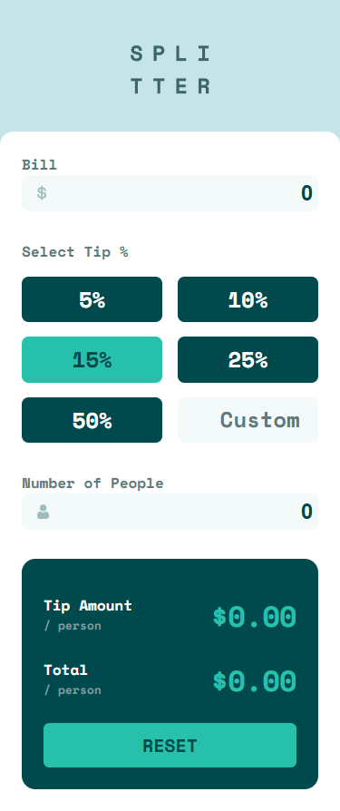
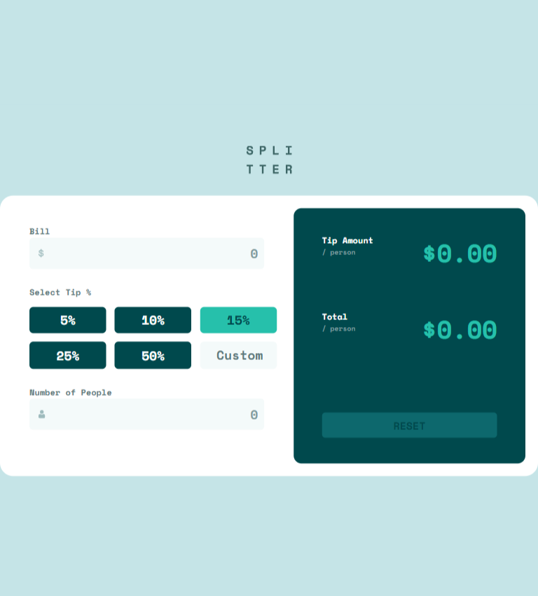

# Frontend Mentor - Tip calculator app solution

This is a solution to the [Tip calculator app challenge on Frontend Mentor](https://www.frontendmentor.io/challenges/tip-calculator-app-ugJNGbJUX). Frontend Mentor challenges help you improve your coding skills by building realistic projects.

## Table of contents

- [Overview](#overview)
  - [The challenge](#the-challenge)
  - [Screenshot](#screenshot)
  - [Links](#links)
- [My process](#my-process)
  - [Built with](#built-with)
  - [Continued development](#continued-development)
- [Author](#author)

## Overview

### The challenge

Users should be able to:

- View the optimal layout for the app depending on their device's screen size
- See hover states for all interactive elements on the page
- Calculate the correct tip and total cost of the bill per person

### Screenshot

### Links

- Solution URL: [https://github.com/gianmromero/tip-calculator-app-main]
- Live Site URL: [https://tip-calculator-app-main-eight-pi.vercel.app/]

## My process

### Built with

- Semantic HTML5 markup
- CSS custom properties
- Flexbox
- CSS Grid
- Mobile-first workflow
- Responsive design
- Vanilla JavaScript
- ValidatorJS
- BEM methodology

### Continued development

I want to keep enhacing my knowledge in BEM Methodology and Vanilla JavaScript in a major level. As well as
improve my responsive design knowledge.

## Author

- Frontend Mentor - [@gianmromero](https://www.frontendmentor.io/profile/gianmromero)
